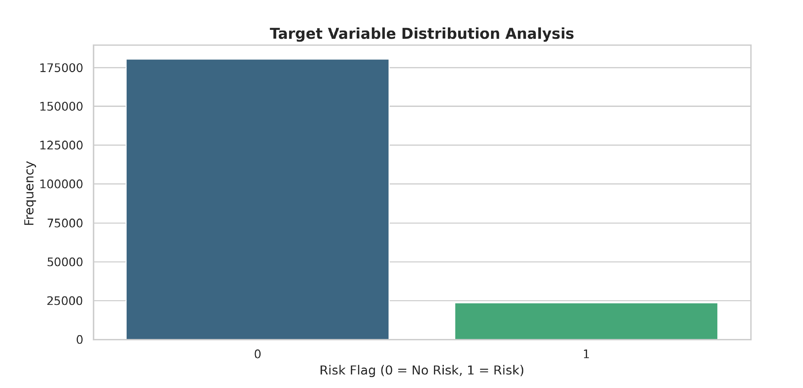
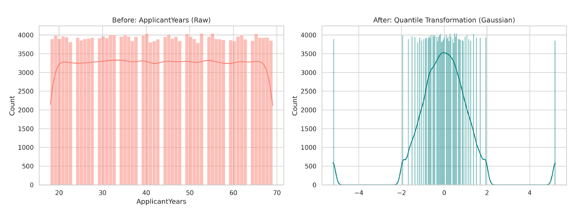
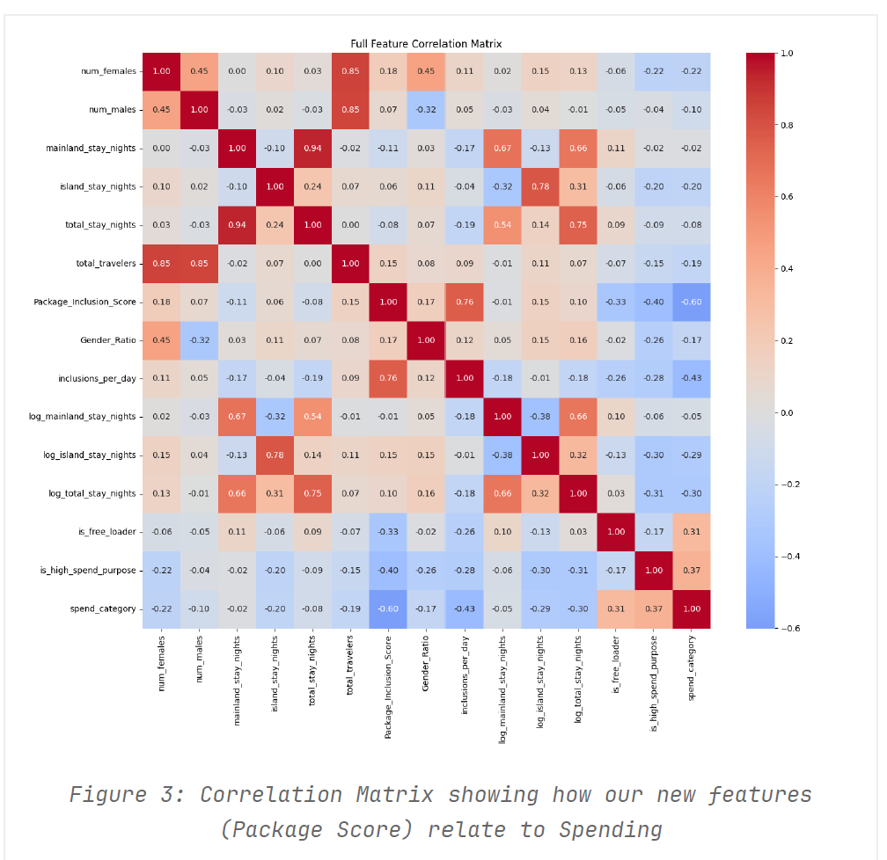
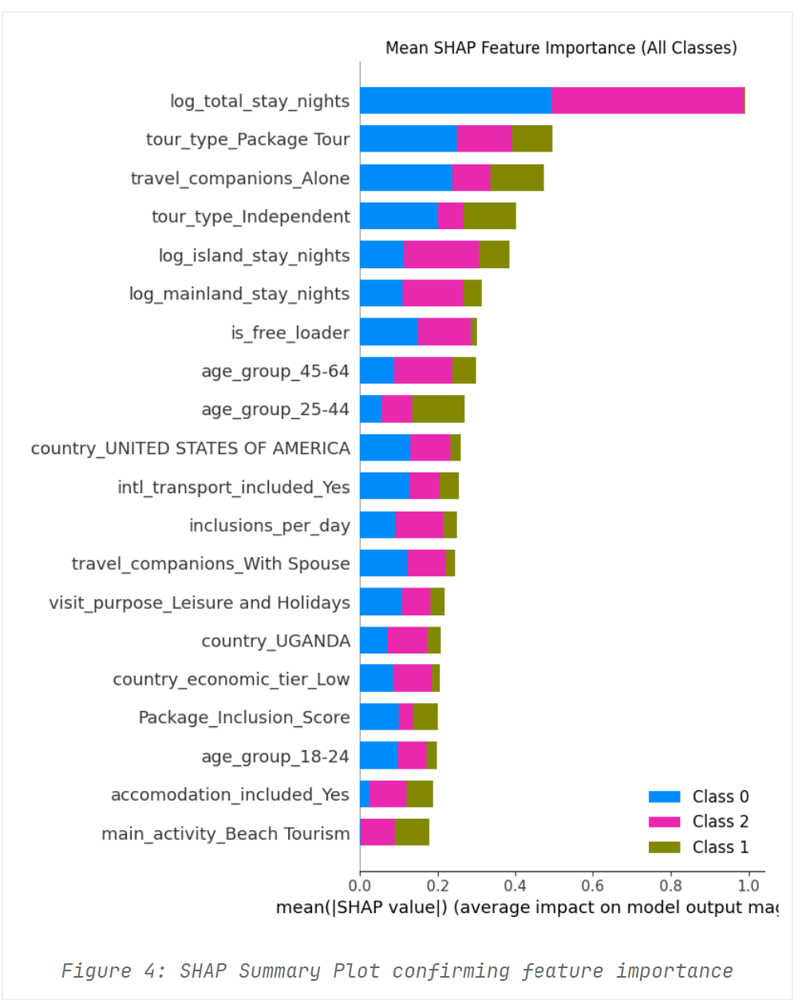

# Advanced Classification Systems: Risk Prediction & Travel Behavior Insights

**Team:** Chicken Biryani  
**Members:** - Unnath Chittimalla (IMT2023620)
- Areen Patil (IMT2023013)  
- Prakrititz Borah (IMT2023547)  

---

## 📖 Overview
This repository contains two distinct machine learning pipelines developed to solve complex classification challenges: **Financial Risk Prediction** (Binary) and **Traveler Spending Classification** (Multiclass). 

Our approach prioritizes data-centric AI over model-centric tuning. We utilized advanced preprocessing (Gaussian Quantile Transformation), domain-specific feature engineering, and hybrid architectures (PyTorch MLPs stacked with SVMs).

---

## 🚀 Project 1: Risk Prediction System
**Goal:** Predict the `RiskFlag` of user profiles based on high-dimensional behavioral and financial data.

### 📊 Exploratory Analysis & Method
We faced a significant class imbalance and skewed numerical features.



*Figure 1: Target Variable Distribution showing the imbalance between "No Risk" (0) and "Risk" (1).*

**The Gaussian Fix:**
Standard scaling failed because features like `ApplicantYears` followed a Power Law. We used **Quantile Transformation** to force these features into a Gaussian (Bell Curve) distribution, stabilizing the Neural Network gradients.



*Figure 2: Transformation of 'ApplicantYears' from raw skewed data (Left) to Gaussian distribution (Right).*

### 🧠 Key Architectures
* **Deep Learning (PyTorch MLP):** Uses a funnel architecture (512 $\to$ 256 $\to$ 128) with **GELU** activation and **OneCycleLR** scheduler.
* **Bagged SVM:** To solve the $O(N^3)$ complexity of SVMs, we implemented a **Bagging Ensemble** where 10 independent SVMs trained on random 15% subsets of the data.

### 📈 Performance
| Model | Accuracy | Key Configuration |
| :--- | :--- | :--- |
| **Deep Learning (MLP)** | **0.888** | OneCycleLR, GELU, Quantile Transform |
| Logistic Regression | 0.887 | SAGA Solver, Elastic Net |
| Bagged SVM | 0.884 | 10 Estimators, RBF Kernel |

---

## ✈️ Project 2: Travel Behavior Insights
**Goal:** Predict traveler `Spend_Category` (High/Medium/Low) using profile and trip details.

### 🧠 Feature Engineering "Secret Sauce"
We engineered features based on domain logic rather than raw columns:
* **Economic Tiering:** Mapped raw country names to GDP tiers (e.g., USA $\to$ High, Kenya $\to$ Low).
* **Package Inclusion Score:** A summation of binary flags (Food + Transport + Guide) to quantify luxury level.
* **Log Normalization:** Applied `np.log1p` to stay durations to handle power-law distributions.



*Figure 3: Correlation Matrix confirming 'Package_Inclusion_Score' as a strong predictor.*

### 🏗️ Hybrid Stacking Architecture
We employed a **Stacking Classifier** with a "Passthrough" strategy:
1.  **Level 0 (Base Models):** * *PyTorch MLP:* Captures complex non-linear patterns.
    * *Linear SVM:* Captures high-dimensional sparse boundaries.
2.  **Level 1 (Meta-Learner):** * *Logistic Regression:* Receives predictions from Level 0 **AND** the original raw features to make the final decision.

### 🔍 Explainability (SHAP)
We validated our model using SHAP values. The engineered feature `log_total_stay_nights` was identified as the #1 predictor of spending.



*Figure 4: SHAP summary plot showing feature impact on model output.*

### 📊 Performance
* **Validation Accuracy:** 71.85% 
* **Macro F1 Score:** 0.67 

---

## 💻 Installation & Usage

### Prerequisites
```bash
pip install pandas numpy scikit-learn torch category_encoders matplotlib seaborn tqdm
